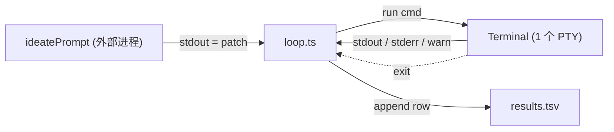

# Autoresearch Loop — TypeScript 最小闭环框架

## 设计原则

- **一个常驻 terminal**。本地 spawn 一个 `bash`（或 `ssh -tt remote`），运行期不重启。所有指令走这一个会话。
- **主循环 = 不停地向 terminal 写一条命令 → 读一坨输出 → 决定下一步**。智能在外部进程（`ideatePrompt`），调度在循环里。
- **输出分三路**：stdout、stderr、warning（含 `warning|warn|deprecated` 的行）。
- **存活检测**：PTY 退出 → `dead` 事件 → 重拉 1 次，连拉 2 次 STOP。
- **代码越少越好**。整个项目不超过 ≈ 400 行 TS。
- **Patch 循环严格对齐 uditgoenka/autoresearch**：`experiment:` commit 前缀、Commit BEFORE Verify、失败 `git revert HEAD`、TSV 按轮 append。



---

## 项目结构

```
autoresearch/
├── package.json                # node-pty + yaml 仅此
├── tsconfig.json
├── autoresearch.yml
├── results.tsv                 # gitignore
└── src/
    ├── index.ts                # 入口 — 加载配置、装 SIGINT、调 runLoop
    ├── config.ts               # YAML 加载 + 默认值
    ├── terminal.ts             # 唯一的 PTY 封装，提供 run(cmd) 接口
    ├── logger.ts               # TSV 追加 / 读回 / bestSoFar
    └── loop.ts                 # 8 阶段主循环
```

---

## 接口伪代码（Claude 实现时补齐）

这一节只给**类型、函数名、严格不变式**。具体实现留给 Claude。

### types

```tsx
interface CmdResult {
  cmd: string;
  exitCode: number;
  stdout: string;     // 只含被包装命令的 stdout，不含回显 / 包装脚本
  stderr: string;
  warnings: string[]; // 从两路里打出的 warning 行
  durationMs: number;
}

interface Config {
  goal: string;
  scope: string[];          // 路径前缀数组，所有变动文件都须在某个前缀下
  remote: string;           // "ssh -tt -o ServerAliveInterval=30 user@host"
  workdir: string;
  ideatePrompt: string;     // shell 命令：stdin = 上下文，stdout = unified diff
  guardCmd: string;
  verifyCmd: string;        // stdout 最后一个 token 必须是数字
  iterations: number;
  plateauPatience: number;
  memoryDepth: number;
  tsvPath: string;
  direction: "lower" | "higher";
}
```

### terminal.ts · 关键不变式（这里最容易写错，必须严守）

```tsx
class Terminal {
  alive: boolean;
  on("dead", cb): void;

  start(): Promise<void>;
  // 不变式：
  //   1. spawn PTY 后，先发一条 sentinel 命令确认 shell ready，再发 `stty -echo; export PS1=''`。
  //      不能 start 一开始就直接 write，bash 还没起来会丢。
  //   2. data 监听只挂一次，在 start() 里。累积到 this.buf。绝不能在每次 run() 里 onData()，会泄漏。
  //   3. PTY exit → alive=false → emit("dead")。

  run(cmd: string, timeoutMs?: number): Promise<CmdResult>;
  // 不变式：
  //   1. 拒绝重入（busy 抛错）。
  //   2. 每次生成随机 marker M = "MK_<ts>_<rand>"。
  //   3. 包装脚本：
  //        { <cmd> ; } \
  //          1> >(sed -u 's/^/__OUT__/') \
  //          2> >(sed -u 's/^/__ERR__/' >&2)
  //        printf '__EXIT__%d__END__M\n' "$?"
  //   4. 结束检测：仅当独立一行匹配 /(^|\n)__EXIT__(\d+)__END__M(\r?\n|$)/ 才算结束。
  //      不要用 includes()，PTY 回显会让发送的命令本身先命中。
  //   5. 拆输出：只取 __OUT__ / __ERR__ 前缀行；其余（bash 回显、PS1 残留）丢掉。
  //   6. warnings = 两路里匹配 /\b(warning|warn|deprecated)\b/i 的行。
  //   7. 超时 / dead 均 reject，不隐藏。超时后进程仍在，下一条 run 能继续。

  dispose(): void;
}
```

### logger.ts

```tsx
// TSV 列：iter  status  metric  delta  exit  warns  desc  ts
// status 枚举：baseline | keep | discard | no-op | crash

function ensure(path: string): void;          // 不存在则创建 header + 方向注释
function append(path: string, row: Row): void;
function tail(path: string, n: number): string;
function bestSoFar(path: string, dir: "lower" | "higher"): number | null;
//   读所有 status∈{keep, baseline} 的 metric，返回最优
```

### config.ts

```tsx
function load(path: string): Config;
// 不变式：
//   - YAML 解析后填默认值：iterations=20, plateauPatience=8, memoryDepth=20,
//     tsvPath="results.tsv", direction="lower"。
//   - scope 接受字符串或数组，统一归一为 string[]。
//   - 不需要 zod。
```

---

## loop.ts · 伪代码（这里是重点）

严格跟随 uditgoenka/autoresearch 的 8 阶段。**让 Claude 照这块写**。

```tsx
export async function runLoop(cfg: Config) {
  ensure(cfg.tsvPath);
  const term = new Terminal("bash", ["--noprofile", "--norc"]);
  await term.start();
  term.on("dead", e => log("[terminal dead]", e));

  // 进入远程会话；后续所有命令都走这条 ssh
  await runOrDie(term, `${cfg.remote} 'cd ${cfg.workdir} && exec bash --noprofile --norc'`);

  // === Setup Phase ===
  let best = bestSoFar(cfg.tsvPath, cfg.direction);
  if (best === null) {
    const v = await runOrDie(term, cfg.verifyCmd);
    best = parseMetric(v);
    append(cfg.tsvPath, row(0, "baseline", best, null, v, "initial"));
  }

  // === Main Loop ===
  let sinceBest = 0;
  let deadRetries = 0;
  let metricErrors = 0;

  for (let n = 1; n <= (cfg.iterations || Infinity); n++) {

    // — 存活检查 —
    if (!term.alive) {
      if (++deadRetries > 2) return stop("terminal dead 2x");
      await term.start();
      await runOrDie(term, `${cfg.remote} 'cd ${cfg.workdir} && exec bash --noprofile --norc'`);
      continue;
    }

    // 1. Review
    const recentLog = await term.run("git log -20 --oneline");
    const tsvTail   = tail(cfg.tsvPath, cfg.memoryDepth);

    // 2. Pick + 3. Modify (Skill 生成 patch)
    //    heredoc 标签用随机后缀，避免上下文里出现同名提前闭合
    const tag = `AR_EOF_${rand()}`;
    const ideate = await term.run(
      `${cfg.ideatePrompt} <<'${tag}'\n` +
      `${recentLog.stdout}\n---\n${tsvTail}\n` +
      `${tag}`,
      10 * 60_000,
    );
    if (ideate.exitCode !== 0 || !ideate.stdout.trim()) {
      append(cfg.tsvPath, row(n, "discard", null, null, ideate, "ideate-fail"));
      continue;
    }

    // 3. Modify · 应用 patch
    const tag2 = `AR_EOF_${rand()}`;
    const apply = await term.run(
      `cat > .ar.patch <<'${tag2}'\n${ideate.stdout}\n${tag2}\n` +
      `git apply --check .ar.patch && git apply .ar.patch`,
    );
    if (apply.exitCode !== 0) {
      append(cfg.tsvPath, row(n, "discard", null, null, apply, "apply-fail"));
      continue;
    }

    // — scope 守护 —
    const diff = await term.run("git diff --name-only");
    const changed = diff.stdout.split("\n").filter(Boolean);
    if (!changed.every(f => cfg.scope.some(s => f.startsWith(s)))) {
      await term.run("git checkout -- . && git clean -fd");
      append(cfg.tsvPath, row(n, "discard", null, null, diff, "out-of-scope"));
      continue;
    }
    if (changed.length === 0) {
      append(cfg.tsvPath, row(n, "no-op", null, null, diff, "no-op"));
      continue;
    }

    // 4. Commit BEFORE verify。commit 前缀 = "experiment:"。
    await runOrDie(term, `git add -A && git commit -m "experiment: iter ${n}"`);

    // 5. Guard
    const guard = await term.run(cfg.guardCmd, 20 * 60_000);
    if (guard.exitCode !== 0) {
      await term.run("git revert --no-edit HEAD");
      append(cfg.tsvPath, row(n, "discard", null, null, guard, "build-fail"));
      continue;
    }

    // 5. Verify
    const v = await term.run(cfg.verifyCmd, 30 * 60_000);
    const metric = parseMetric(v);
    if (metric === null || v.exitCode !== 0) {
      await term.run("git revert --no-edit HEAD");
      append(cfg.tsvPath, row(n, "crash", null, null, v, "verify-bad"));
      if (++metricErrors >= 2) return stop("2x metric-error");
      continue;
    }
    metricErrors = 0;

    // 6. Decide
    const better = cfg.direction === "lower" ? metric < best : metric > best;
    if (better) {
      const delta = metric - best;
      best = metric; sinceBest = 0;
      append(cfg.tsvPath, row(n, "keep", metric, delta, v, "keep"));
    } else {
      await term.run("git revert --no-edit HEAD");
      sinceBest++;
      append(cfg.tsvPath, row(n, "discard", metric, metric - best, v, "regress"));
    }

    // 7. Log · 已在每条分支 append

    // 8. Repeat / Stop conditions
    if (sinceBest >= cfg.plateauPatience) return stop(`plateau ${sinceBest}/${cfg.plateauPatience}`);
  }

  term.dispose();
}
```

辅助函数（伪代码）：

```tsx
function parseMetric(r: CmdResult): number | null;
//   r.stdout.trim() 末 token，去掉 "," " "，Number()。不是有限数返回 null。

function row(n, status, metric, delta, r, desc): TsvRow;
//   { iter:n, status, metric, delta, exit:r.exitCode, warns:r.warnings.length, desc, ts:ISO }

function runOrDie(t, cmd): Promise<CmdResult>;  // exitCode!==0 则 throw
function stop(reason: string): void;            // log、term.dispose()、return
function rand(): string;                        // 8 位随机后缀
```

---

## src/index.ts · 伪代码

```tsx
const cfg = load(process.argv[2] ?? "autoresearch.yml");

process.on("SIGINT", () => {
  console.error("[interrupt] stopping after current iteration");
  process.exit(130);
});

runLoop(cfg).catch(e => { console.error("[fatal]", e); process.exit(1); });
```

---

## autoresearch.yml · 示例

```yaml
goal:    最小化 angle_perftests 的 cpu-cycles
remote:  ssh -tt -o ServerAliveInterval=30 -o ServerAliveCountMax=3 sean@build-host
workdir: /home/sean/angle
scope:
  - src/libANGLE/State.h
  - src/libANGLE/Program.h
  - src/libANGLE/Context.h
ideatePrompt: |
  python3 /home/sean/skill/run.py            # 读 stdin，stdout 纯 patch
guardCmd:  autoninja -C out/Release angle_perftests
verifyCmd: |
  perf stat -e cpu-cycles ./out/Release/angle_perftests \
    --gtest_filter='*DrawQuad*' --iterations=100 2>&1 \
    | grep cpu-cycles | awk '{print $1}' | tr -d ','
direction: lower
iterations: 20
plateauPatience: 8
memoryDepth: 20
tsvPath: results.tsv
```

---

## 调试与监督

- **实时 mirror**：Terminal 里 `proc.onData(d => process.stderr.write(d))` 默认开。
- **警告趋势**：TSV `warns` 列上涨 → patch 质量下降。
- **SSH 续命**：`remote` 里包含 `ServerAliveInterval`，断连 1–2 分钟内被检出。
- **超时预算**：run 默认 5min，guard 20min，verify 30min。不默默重试。
- **错误路径枚举**：dead · timeout · ideate-fail · apply-fail · out-of-scope · no-op · build-fail · crash · metric-error · plateau。

---

## 不要加的东西

- 别引 zod / execa / pino。
- 别开 web UI / dashboard / 别并行。
- 别加「Skill 自进化」外层循环；本项目只负责「patch 闭环」。
- 别在 `terminal.ts` 外面再起其他子进程。唯一进程，唯一会话。
- 别为了调试绕过 sentinel marker。靠 sleep / 重启 都会坏。

---

## 参考：uditgoenka/autoresearch

来源：<[https://github.com/uditgoenka/autoresearch>。原项目把](https://github.com/uditgoenka/autoresearch>。原项目把) Karpathy 的 autoresearch 抽成了一个 Claude Code Skill。本框架 = 把它的主循环**外化**为不绑定 LLM 的独立驱动器。

### 主循环（8 步）

```
LOOP (FOREVER or N times):
  1. Review  — git history + results.tsv
  2. Pick    — 按「成功 / 失败 / 未试」选下一改动
  3. Modify  — ONE focused change
  4. Commit  — git commit（在 verify 之前）
  5. Verify  — 机械化校验
  6. Decide  — improved→keep；worse→git revert；crash→fix or skip
  7. Log     — TSV
  8. Repeat
```

### Setup Phase

Read context → Define goal → Define scope → Establish baseline → Confirm。

### 8 条硬规则

1. Loop until done
2. Read before write
3. One change per iteration
4. Mechanical verification only
5. Automatic rollback
6. Simplicity wins
7. Git is memory — `experiment:` 前缀、`git revert` 保留失败、每轮读 `git log` + `git diff`
8. When stuck, think harder

### 与本框架的映射

| uditgoenka/autoresearch | 本框架 |
| --- | --- |
| Claude Code 内核 + `SKILL.md` 选 patch | `cfg.ideatePrompt` 外部进程 |
| LOOP 1 Review | `git log -20`  • `tail(tsv)` |
| LOOP 2 Pick | `ideatePrompt` 背后的脚本 |
| LOOP 3 Modify | `git apply .ar.patch` |
| LOOP 4 Commit | `git commit -m "experiment: iter N"` |
| LOOP 5 Verify | `guardCmd`  • `verifyCmd` |
| LOOP 6 Decide | `metric < best ? keep : git revert HEAD` |
| LOOP 7 Log | `append(tsv, ...)` |
| `Iterations: N` | `cfg.iterations` |
| `Guard: <cmd>` | `cfg.guardCmd` |

**核心差异**：智能在外（`ideatePrompt`），调度在里（`loop.ts`）。可以接 Copilot CLI / Claude CLI / Codex / 本地脚本，驱动器本身不绑定任何 LLM。

---

## Claude 实施清单

一次一个 Milestone，上一个验收不过不进下一个。

1. **M0 骨架**：`pnpm init` + `tsconfig` + 5 个 `src/*.ts` 空 stub。`pnpm build` 零错。
2. **M1 terminal.ts**：按上面不变式实现。`scripts/test-term.ts`：
    - `run("echo HI")` → stdout="HI" stderr="" exit=0
    - `run("echo BAD >&2; false")` → stdout="" stderr="BAD" exit=1
    - `run("echo warning: foo")` → warnings.length === 1
    - 连发 100 次不泄漏 listener（验证 onData 只挂一次）
    - kill PTY → alive=false 且 dead 事件被触发
3. **M2 logger.ts**：`scripts/test-log.ts`：append 3 行、`bestSoFar` 返回最优、`tail(n)` 取末 n 行。
4. **M3 loop.ts 主循环**：本机 sandbox 跑一轮。
    - `remote` = `bash -c`；workdir = `tmp-target`（`git init` 空仓）
    - `ideatePrompt` = `cat scripts/fixtures/fake.patch`
    - 验收：TSV 出现 baseline 行 + iter1 行；tmp-target 多一个 `experiment:` commit 或 revert commit。
5. **M4 错误路径**：8 个脚本覆盖 ideate-fail / apply-fail / out-of-scope / no-op / build-fail / crash / plateau / terminal-dead。最后打印 `8/8 passed`。
6. **M5 README + tagging**：一页 README；`0.1.0`。

全程不超过 400 行 TS。**不加依赖、不加 UI、不并行、不重试**。